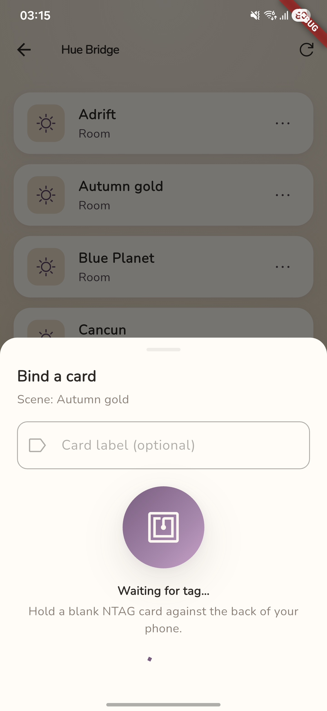

# HueTap



[](https://github.com/empyreanexile/huetap/actions/workflows/ci.yml)
[](LICENSE)

An Android app that fires pre-configured Philips Hue scenes by tapping NFC cards.

**Status:** pre-v1.0. Spec is [locked at v1.4](SPEC.md); implementation is underway. Not yet released.

**Platform:** Android only.

**Requirements:** Android 14 (API 34) or newer, with NFC hardware.

## What it does

Tap an NTAG NFC card with your phone and a Hue scene plays on the bound bridge. The app is only for setup — binding cards to scenes, managing bridges, and viewing the tap log. Once configured, you never need to open it. Communication is LAN-only via Hue's CLIP v2 API; no accounts, no cloud.

Multi-bridge homes are first-class: each card binding carries its own bridge reference, and taps on different bridges fire in parallel.

## Install

Pre-v1.0 builds are published as debug-signed APKs from CI on every semver tag.

1. Go to the [Releases page](https://github.com/empyreanexile/huetap/releases).
2. Download the APK matching your phone's ABI:
   - `app-arm64-v8a-debug.apk` — most modern phones (Android 14+, 64-bit)
   - `app-armeabi-v7a-debug.apk` — older 32-bit phones
   - `app-x86_64-debug.apk` — emulators
3. Verify against `SHA256SUMS`.
4. Sideload: Settings → Apps → Special access → Install unknown apps → allow your file manager or browser, then open the APK.

Play Store availability and release-signed builds will follow once the keystore + listing assets are ready.

## Build from source

```bash
flutter pub get
flutter analyze
flutter test
flutter build apk --debug --split-per-abi
```

See [CONTRIBUTING.md](CONTRIBUTING.md) for the full contributor setup.

## Documentation

- [`SPEC.md`](SPEC.md) — full requirements specification (source of truth)
- [`CONTRIBUTING.md`](CONTRIBUTING.md) — how to contribute
- [`PRIVACY.md`](PRIVACY.md) — privacy policy
- [`SECURITY.md`](SECURITY.md) — security policy and threat model notes
- [`CODE_OF_CONDUCT.md`](CODE_OF_CONDUCT.md) — community standards
- [`CHANGELOG.md`](CHANGELOG.md) — release notes
- [`docs/`](docs) — setup, NFC card buying guide, troubleshooting, architecture, i18n

## License

MIT. See [`LICENSE`](LICENSE).
